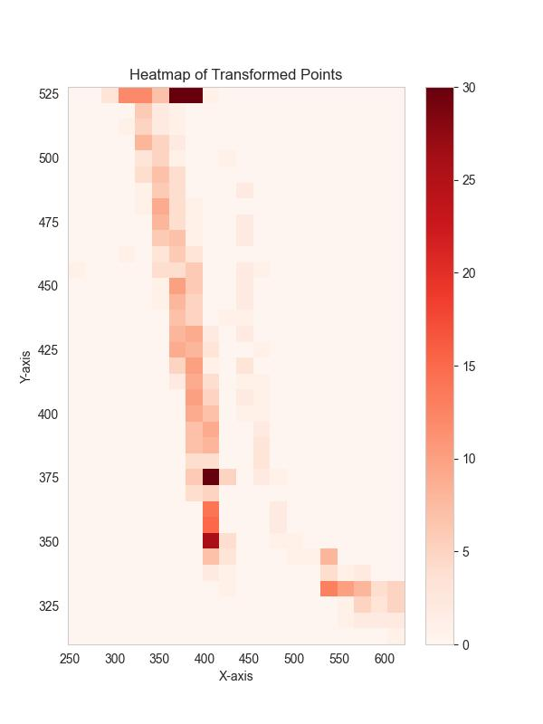

# Homography 
## (Justin is coming!)

Hi this for the **Homography** transition used after process of YOLO Detection of pedestrain

----
### Contents
 
> 1. video_to_images_01 
> : Turns Video file into Framerate images
> 2. homography_set_02 : creating a Homography Matrix by placing dots from the reference image
> 3. detect_and_map_03 : Applying homography to video frame images and turning it to heatmap plot

</img> 
</img> 
</img> 